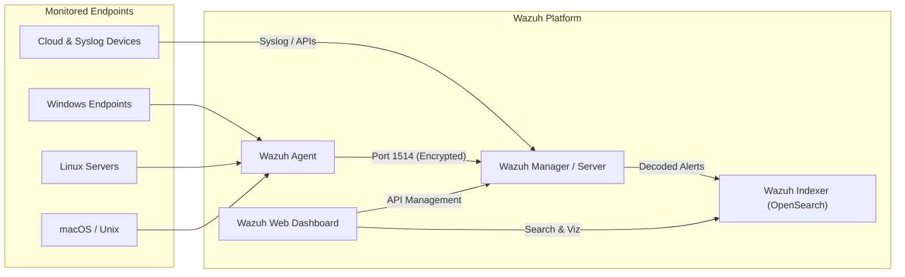

# 🛡️ Wazuh SIEM & Security Operations Course

[](https://wazuh.com/)
[](https://wazuh.com/)
[](https://wazuh.com/)
[](https://attack.mitre.org/)
[](LICENSE)

Welcome to the **Wazuh SIEM & Security Operations Course** repository. This project provides a comprehensive learning path, hands-on lab architecture, and detailed documentation on implementing and managing **Wazuh** — an open-source Unified XDR (Extended Detection and Response) and SIEM platform.

---

## 📑 Table of Contents

- [Overview](#-overview)
- [Course Curriculum](#-course-curriculum)
- [Key Features & Capabilities](#-key-features--capabilities)
- [Wazuh Architecture](#-wazuh-architecture)
- [Repository Structure](#-repository-structure)
- [Quick Start](#-quick-start)
- [Contributing & License](#-contributing--license)

---

## 🧐 Overview

Modern Security Operations Centers (SOC) require full visibility across endpoints, cloud workloads, network traffic, and containerized environments. This course bridges the gap between theoretical SIEM concepts and hands-on detection engineering using **Wazuh**.

---

## 📚 Course Curriculum

The main course material is available in [`course/WazuhSIEM.md`](./course/WazuhSIEM.md) and covers:

1. **Part 1: Introduction to SIEM**
   - What is SIEM? (SIM vs. SEM)
   - Core SIEM Functions: Log Aggregation, Parsing/Normalization, Real-Time Event Correlation, Threat Intel Enrichening, and Compliance Reporting.
2. **Part 2: Introduction to Wazuh**
   - Core Architecture: Agent, Manager/Server, Indexer (OpenSearch), and Dashboard.
   - Endpoint Detection & Response (EDR) and File Integrity Monitoring (FIM).
   - Vulnerability Detection & MITRE ATT&CK framework mapping.
   - Active Response & Automated Incident Mitigation.
   - Traditional SIEM vs. Wazuh Unified XDR comparison.

---

## ⚡ Key Features & Capabilities

| Feature Category | Capabilities |
| :--- | :--- |
| **Endpoint Security (EDR/XDR)** | File Integrity Monitoring (FIM), rootkit detection, process auditing, user activity tracking. |
| **Log Data Analysis** | Multi-source log collection, normalization, custom decoders, and correlation rule sets. |
| **Vulnerability Detection** | Automated CVE scanning for OS and third-party software against National Vulnerability Databases. |
| **MITRE ATT&CK Mapping** | Native mapping of all alerts to Tactics, Techniques, and Procedures (TTPs). |
| **Active Response** | Triggering local firewall blocks, process termination, or endpoint isolation upon threat detection. |
| **Compliance Auditing** | Out-of-the-box dashboards for **PCI-DSS**, **GDPR**, **SOC 2**, **HIPAA**, **NIST 800-53**, and **CIS Benchmarks**. |

---

## 🏗️ Wazuh Architecture



---

## 📁 Repository Structure

```text
Wazuh SIEM/
├── course/
│   ├── WazuhSIEM.md          # Complete SIEM & Wazuh documentation and notes
│   ├── Images/               # Course diagrams and graphics
│   ├── pdf/                  # Exported PDF documentation
│   └── screenshots/          # Hands-on lab screenshots
├── docker/                   # Docker Compose environment (coming soon)
└── README.md                 # Project Overview & Guide
```

---

## 🚀 Quick Start

1. **Read the Course Material**:
   Open [`course/WazuhSIEM.md`](./course/WazuhSIEM.md) to explore the SIEM fundamentals and Wazuh architecture breakdown.

2. **Deploying Wazuh (Docker)** *(Optional)*:
   Check the `docker/` folder for upcoming Docker Compose deployment scripts to launch a single-node or multi-node Wazuh stack locally.

---

## 📄 License

This repository is maintained for educational purposes. Feel free to use and adapt the material.
