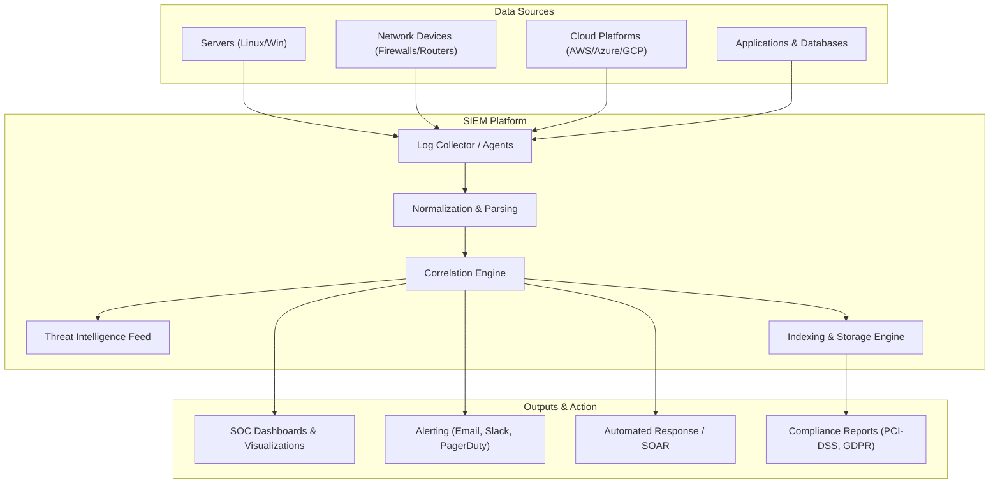
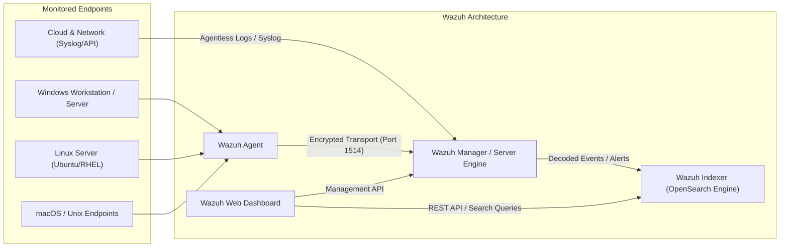

# Comprehensive Introduction to SIEM & Wazuh

```text
   Creator: Yahyaoui Med Aziz | 260726
   Editor: Antigravity
   Defintions: gemini  
```

---

## Part 1: Introduction to SIEM (Security Information and Event Management)

### 1. What is SIEM?

**SIEM** (pronounced *sim*) stands for **Security Information and Event Management**. It is a security solution that helps organizations detect, analyze, and respond to security threats before they harm business operations.

SIEM combines two original concepts:

* **SIM (Security Information Management):**

 Automates the collection, long-term storage, analysis, and reporting of log data for compliance and historical audit purposes.

* **SEM (Security Event Management):** Monitors systems in real-time, correlates event data, sends alerts, and provides console views for security analysts.



---

### 2. Core Functions of a SIEM

1. **Log Aggregation & Centralization:** Collects logs from diverse sources across the infrastructure into a single pane of glass.
2. **Data Normalization:** Converts unstructured logs from different vendors and OS formats into a standardized, searchable format (e.g., JSON).
3. **Real-Time Event Correlation:** Evaluates log events against rules and algorithms to identify suspicious patterns (e.g., 5 failed SSH logins followed by a successful login within 30 seconds).
4. **Threat Detection & Intelligence:** Cross-references internal logs with external Threat Intelligence feeds (IP reputation, malicious file hashes).
5. **Security Operations & Incident Response:** Provides security analysts with actionable alerts and context to investigate incidents quickly.
6. **Regulatory Compliance:** Generates automated reports demonstrating compliance with standards like PCI-DSS, HIPAA, SOC 2, NIST, and GDPR.

---

## Part 2: Introduction to Wazuh

### 1. What is Wazuh?

**Wazuh** is a free, open-source enterprise-grade **Unified XDR (Extended Detection and Response)** and **SIEM platform**. Originally created as a fork of OSSEC, Wazuh has evolved into a comprehensive security monitoring ecosystem used by organizations worldwide.

Wazuh provides multi-platform agent-based and agentless monitoring across endpoint devices, cloud environments, containerized environments, and network equipment.



---

### 3. Key Features of Wazuh

| Feature Category | Description |
| :--- | :--- |
| **Endpoint Security (EDR)** | Performs File Integrity Monitoring (FIM), detects rootkits/malware, audits system configuration, and tracks active processes. |
| **Log Data Analysis** | Collects and parses system, application, audit, and network logs using custom or pre-built decoders and rules. |
| **Vulnerability Detection** | Discovers software vulnerabilities (CVEs) installed on endpoints by cross-referencing system inventories with official CVE databases. |
| **Threat Intelligence & MITRE ATT&CK** | Maps all security alerts directly to the **MITRE ATT&CK framework** matrix, enabling swift mapping of adversary tactics and techniques. |
| **Active Response** | Runs automated scripts on agents to mitigate ongoing threats (e.g., blocking an IP in the local firewall, killing a malicious process, isolating an endpoint). |
| **Cloud & Container Security** | Integrates natively with AWS, Azure, GCP, Docker, and Kubernetes to track security events and resource posture. |
| **Regulatory Compliance** | Includes ready-to-use compliance dashboards for **PCI-DSS, CIS Benchmarks, GDPR, NIST 800-53, and TSC (SOC 2)**. |

---

### 4. Core Components of Wazuh Architecture

1. **Wazuh Agent:**
   * A lightweight service installed on endpoints (Windows, Linux, macOS, Solaris, AIX).
   * Runs local checks (FIM, rootkit detection, process monitoring) and securely forwards event logs to the manager.

2. **Wazuh Server (Manager):**
   * The processing center. Receives data from agents or agentless syslog sources.
   * Decodes incoming logs, compares them against security rule sets, enriches events with threat intel, and generates alerts.

3. **Wazuh Indexer:**
   * A highly scalable, full-text search engine based on OpenSearch.
   * Stores indexed alerts, historical data, and security events for fast query performance.

4. **Wazuh Dashboard:**
   * A web-based UI for data visualization, security analytics, alert management, compliance reporting, and system administration.

---

## Summary Comparison: Traditional SIEM vs. Wazuh

* **Traditional SIEM:** Focuses primarily on centralized log storage and rule-based correlation across network devices and servers. Often expensive and complex.
* **Wazuh:** Combines **SIEM** (log analysis, correlation, compliance) with **EDR** (endpoint detection, file integrity monitoring, active response, vulnerability management) into an open-source, cost-effective platform.
